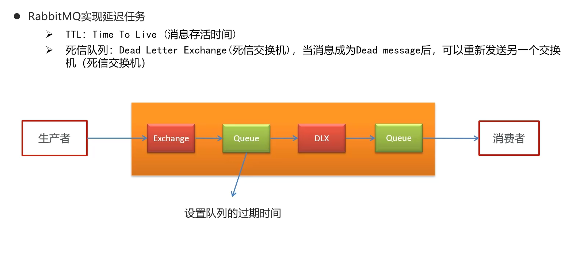
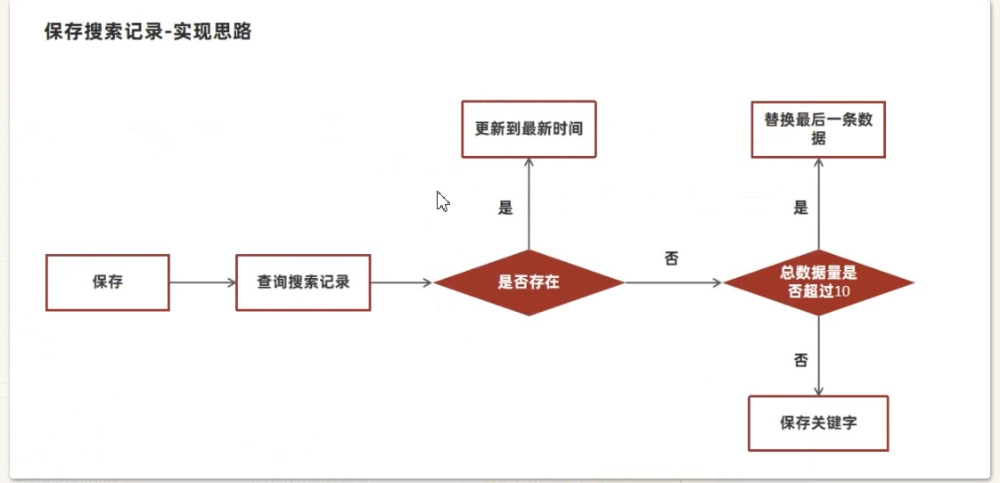

#头条资讯梳理

* 手动加密 , md5+盐进行加密  ,md5不安全 , 因为md5每次的加密都一样 , 最好用加盐的方式

* 当用户登录验证成功后 (基于当前用户的id生成),生成jwt , 如果是游客登录的话 基于0生成jwt , 游客和登录的用户登录后的权限不一样

## 登录逻辑

* 首先根据, 是否同时有手机和验证码, 来验证是否是用户登录还是游客登录, 判断手机号和密码是否为空 StringUtils.NotBlank

* 1. 首先查询用户,看看数据库中是否有已经保存的用户, 如果没有 , 那就返回错误
  2. 如果根据手机号找到了相关的数据, 那么就进行密码的比较 , 这次要在User表中额外获取 salt  , 操作为: 获取盐值和密码(), 然后根据md5进行加密 , 然后进行对比, (Ap_user表中存储的是加了盐值的md5的版本) , 如果对比成功就下一步, 如果没有对比成功, 就返回错误结果集.
  3. 在对比成功的情况下 , 生成jwt 并返回 , 需要返回的是Json形式Map集合,这里用一个实体类进行封装,成员变量为token和user , "token" 的 值为jwt工具根据id生成 . 
  4. 因为要在实体类中存入登录的user , 不能返回盐值和密码 , 所以把盐值和密码置为空 , 然后进行存入到实体类中 ,和token一起返回给前端
  5. 如果没有正常登录, 就根据游客的形式进行返回 

### 网关

* 网关要进行权限验证和路由 用过滤器进行操作

* 路由的时候 , 要开启负载均衡 , 对于过滤器 , 其执行流程是 默认过滤器 专门的路由过滤器  全局过滤器
* 对于符合当前路由规则的请求, 要进一步验证其功能, 是进行登录 , 还是进行其他请求 , 其中其他请求要求有 jwt token


* 全局过滤器设置 先从exchange中获取request和response

* 登录路径的检查是在 uri的path中是否包含有"/login"字段
* 如果是 则放行 放行的是exchange
* 如果不是查看是否有token , token在head中 用request请求获取
* 如果没有的话, 就向response中设置,未授权状态码, 状态码是由HttpStatus设置的,他是HTTP的一个枚举类
* 最后返回,response.setComplete();即可 

* 如果有token的话, 就判断其是都有效 , 判断有效的方式是由AppJwtUtil进行的, 如果结果是 1 或2 就说明失效了 ,要返回未授权结果 , 验证过程可能会出现错误 , 要用try-catch进行确保

* 最后 ,是有token且未失效的情况 ,直接放行 chain.filter(exchange);
* 最后要设置优先级 , getOrder()方法 ,返回值越小 ,优先级越高 ,一般设置为0 ,最高级

## APP文章管理

* 关于文章有三张表进行协同记录, 一张是主体表, 记录文章的文章的基本信息 , 第二张是文章的配置表, 记录对应文章是否可以评论, 点赞等权限设置信息, 第三章表是文章内容表, 因为文章的字数很多 , 最好不要和文章基本表放在一起, 这样会因为内容字段的过大和严重影响对应的查询速度. 一般查询数量较多的是文章的基本表 , 需要查询到具体内容的时候去查询文章的内容表.

### 文章的预览

* 默认显示10条内容 ---page查询
* 可以切换频道查询不同种类的文章--->有分类条件
* 上拉和下拉会根据10个文章中时间最大的或时间最小的进行查询--> 根据时间和类型进行条件查询
* 接口的定义, 对应三种的查询方式


* 传进来的参数 也是根据条件组合而封装而成的实体类

```java
@Data
public class ArticleHomeDto {

    // 最大时间
    Date maxBehotTime;
    // 最小时间
    Date minBehotTime;
    // 分页size
    Integer size;
    // 频道ID
    String tag;
}
```

* 注意 用户的登录, 以及文章的查询 都是在service微服务中进行的 ,所以要进行子模块的填写

* 上述三种方式都写的话, 会冗余, 因此将三种归为一种在service层进行整合 , controller会发送short类型的请求类型,如果是1就是请求加载更多 , 如果是2就是加载最新 , 传递过来的dto可能没有大小参数, 需要手动去设置, 如果

* 因为查询涉及到文章基本表和文章设置表(设置表中被删除或被下架,则不能展示),本质还是展示文章基本表,但是查询时涉及文章设置表 ,涉及联查 ,mybatis-plus不能进行, 因此要进行在mapper中设置方法, 在resources用mybatis进行操作

* service查询逻辑中, 要进行查询条数的验证 , 没有的话设置为10 有的话要保证不超过50 
* 然后设置查询类型, 如果没有的话就设置为查询更多, 然后设置标签, 如果dto中没有标签的话, 就设置为默认标签. 最后设置最大时间和最小时间, 没有的那一方设置为当前时间. 最后用mybatis-plus的page去接收, 设置当前的页为1 设置不需要查询总条数 设置当前条数, 最后再mapper中用page参数去接收page对象 ,最后返回Ipage对象, 内部的处理由mybatis负责.

## 文件上传

* 采用minio加freemarker进行文章的存储 , 通过freemarker加数据生成html模板 然后存储到minio容器中
* 先通过传来的ApArticleContent中的articleId来找出对应文章的内容 ,判断其是否为空 , 不为空的话就进行下一步

* 然后进行输出流, 然后通过configuration 设置模板文件
* 模板文件需要将内容以HashMap的形式存储进去, key为content value为文章内容的JSON字符串形式
* 然后进行根据模板生成html静态页面, 需要传入HashMap和输出流, 最后会将生成的html静态页面存入到输出流中,
* 但是上传至Minio需要输入流, 所以用ByteArrayInputStream进行输出流和输入流的切换
* 最后上传至minio, 用文章id加".html"的方式进行操作
* 上传后, 记得修改ApArticle表,将上传至minio后生成的url和文章id存入到文章表中 ,然后根据id进行修改


## 自媒体文章

### 素材管理

* 首先要进行网关的设置, 大体设置和文章的网关一样, 不过因为后续需要用到用户的id, 所以要把id存储到Header里面

* 将用户信息存储到Header中需要重置request和exchange(在验证token没有失效的情况下)

```java
//获得用户信息
            Object userId = claimsBody.get("id");
            //将用户信息存储到Header中, 进行request的重新封装
            ServerHttpRequest serverHttpRequest = request.mutate().headers(httpHeaders -> httpHeaders.add("userId", userId + "")).build();
            //重置Header, 进行exchange的重新封装,exchange全局只有一个, 所以不用重新复制
            exchange.mutate().request(serverHttpRequest).build();
```

* 存储到Header中的用户信息怎么在以后的业务中运用呢? ----> 存储到ThreadLocal中 

* 所以设置一个ThreadLocalUtils, 进行设置和获取
* 在自媒体微服务中进行拦截器的设置(一般ThreadLocal的设置 是在微服务中的拦截器进行的, 单体架构一般是是在过滤器)

* 拦截器中用到了Optional.ofNullable(userId); 这是jdk1.8的用法, 用于null值的防御性检查,在userId为null时,创建一个空的Optional对象并传进去, 这样就不会有空指针异常的问题了
* 存入ThreadLocal中的是WmUser对象,其中id需要Integer类型 用Integer.valueOf(userId)
* 在过滤器的POSTHandle方法中, 要把threadlocal清除, 防止下一次用户的访问不受检查

### 图片上传

* 前端上传的信息会传递给自媒体微服务中, 因为涉及minio操作和自媒体素材表的操作, 因此要在业务层进行
* 因为涉及两个方面的同时成功操作, 因此要加上事务

* 先检验参数是否存在, 不存在的话返回错误结果集AppHttpCodeEnum.PARAM_INVALID  (其中图片格式的存在与否用 multipartFile == null || multipartFile.getSize() == 0 )
* 如果存在就进一步验证是否能拿到userId , 因为token在通过网关的检验后, 仍有几率过期失效, 如果没有从ThreadLocal中获取到userId, 则抛出自定义异常new CustomException(AppHttpCodeEnum.NEED_LOGIN);
* 如果都通过的话, 就准备进行minio的操作, 首先通过UUID获取文件名,将其中的-替换为"",这样比较规范,然后获取原始的文件名称,通过原始的文件名称,获取文件后缀, 这里要验证文件的合格性,判断原文件名称中是否有 "." ,如果返回的是 不是  -1没有的话, 就进一步进行文件名后缀的提取, 然后和UUID生成的文件名组合 然后 覆盖掉后者
* 存储到minio后返回的路径名这个设计外置服务器业务过程可能会出错, 要用try catch进行包裹, 出错的话抛出自定义异常来为用户提供友好提示, 因为try catch模块问题 路径名的定义要在模块外面, 如果出错的话//抛出异常作用：1.事务回滚 2.通过全局异常处理器向前端返回异常提示
* 最后要设置自媒体素材表中的数据, 除了刚才获得图片路径名,还要设置用户id 是否收藏 类型 创建时间这些需要自己定义的默认值
* 保存的结果涉及到了两种业务的成功与否 ,所以 保存自媒体素材表的过程也要用try catch进行包裹, 出错的话,就根据图片路径名删除刚才存储的图片 ,抛出异常,注意删除图片操作要在抛出异常前(在catch中抛出 e) 成功的话要在try块中返回成功结果集 , 注意因为要回显 ,所以要在结果集中存入自媒体素材信息.

### 素材列表查询

* 前端所传递过来的参数,是pageRequest 的dto  增加了是否收藏的选项, 有page size属性, 并把没有page参数时设置为1 和 size没有或不合规时设置为10 的方法封装在dto中  前端传来的参数包含着 page size  isCollection三个值
* 注意要用分页构造器, 查询条件包含用户的id  是否是收藏 还要根据创建时间进行排序
* 查询收藏的是可有可无的条件, 只有当isCollection为2的时候采取添加条件, 当条件不足以

* 向前端返回的记过为结果集的子类, PageResponseResult, 要设置 Integer类型的 当前页 大小 总条数 , 然后构造出来后把查询到的records里面的信息设置进去

### 频道查询

* 这里直接查询所有的频道即可,只需要添加一个按照排序和创建时间升序查询的条件即可

```java
List<WmChannel> list = wmMaterialService.list(Wrappers.<WmChannel>lambdaQuery()
                .orderByAsc(WmChannel::getOrd, WmChannel::getCreatedTime));
```

### 自媒体文章查询

* 前端传递过来的参数是WmNewsPageReqDto,继承了PageRequestDto, 有page size 还有所属状态 开始时间 结束时间 所属Id 关键字

* 查询前要进行参数和登录人的验证, 通过后创建分页构造器,  其中  状态 频道 时间范围都是根据实际情况进行查询的,关键字模糊查询是对应文章标题的, 最后根据用户id添加根据发布时间倒叙
* 向前端返回的记过为结果集的子类, PageResponseResult, 要设置 Integer类型的 当前页 大小 总条数 , 然后构造出来后把查询到的records里面的信息设置进去

### 文章发布


#### 数据处理

* 首先进行参数检验, 保证参数 以及 内部的一些必须有的属性 不为空  其中标题要保证长度在2-6之间  其中对null的判断要放在前面,如果出错,就返回错误结果集
* 然后从DTO中复制出WmNews对象用于后续的自媒体文章的保存
* 注意 图片有两种 一种在images中, 是封面图片, 一种在content里面 由Json形式的List<Map>中保存, 此集合中不光有图片, 还包括文章文字内容, 如果key值为type的value值为image, 则key值为value的value值为图片(后续中封面自动的获取的情况也是从content中获取)


* 首先获取内容中的图片,将其从JSON字符串转换为List<Map>集合,然后遍历集合,将里面的图片信息保存到一个List<String>集合中,然后用流去重,减少后面操作的耗费
* 内容图片获取之后, 获取封面图片,但是封面图片不一定就是最后的封面图片, 如果选择自动的话, 就会从内容图片中根据图片数量进行选择操作, 注意equals方法中最好把一定不为空的数据放在前面

* 因为封面图片保存到数据库中的是字符串形式, 多张图片的情况下是多个图片url用","连接在一起,用StringUtils.join(images,",")
* 将Enable设置为1
* 判断状态是否为草稿, 为草稿的时候不用设置提交时间,状态由dto的状态不为空 和 WmNews中的枚举类WmNews.Status.SUBMIT.getCode()决定
* 设置文章的用户id
* 接下来判断是新增还是更新, 判断是否有文章的id, 如果没有的话,就是新增, 设置创建时间,并保存到文章表中, 如果有的话就是修改, 先根据文章id 删除素材关联表中的所有的关联, 然后进行文章的修改
* 接下来判断不为空且是不是草稿, 如果是草稿的话,就直接结束(if (dto.getStatus() != null && WmNews.Status.NORMAL.getCode()==dto.getStatus())), 返回成功结果集, 如果不是的话 就要保存内容图片与文章的关联, 封面图片与文章的关联, 然后进行文章的审核, 最后返回成功结果集

#### 图片文章关联表

* 上面文章保存后会进行内容图片和封面图片的保存,因为在保存文章的时候就已经分好了内容图片集合还有封面图片集合,所以用一个方法接收即可,
* 接收参数为urls 图片路径的List集合, 文章id , 还有图片类型,关联表中会保存是内容还是封面
* 首先判断图片路径集合是否为空, 为空就直接返回, 说明没有图片需要保存, 也就没有图片文章关联需要保存
* 然后根据urls配合sql中的in  来获取图片素材的集合, 随后和urls的大小进行对比, 如果长度不一样, 说经在包存期间,素材库的图片被删除, 发生了变化,对应不上 ,因此需要回滚业务 抛出自定义异常来回滚业务
* 如果上述都没问题的话 就从图片素材的集合中利用流的方式获取图片id的集合,然后和文章id 素材类型一同保存到图片文章关联表中


## 文章自动审核

* 用的是阿里云API接口

## app文章保存

* 文章表所在的数据库需要存放大量的数据, 但是一个数据库可能承受不住这样的数据量, 因此考虑要用数据库分片技术来.将应该放在一个数据库中的数据分别放在几个数据库中来分担压力, 数据库之间通过中间件来连接. 但是每个数据库的文章表都使用自增ID的话,那么文章的id可能会产生重复的id造成问题, 因此需要采用分布式id生成策略来生成id


* 文章端相关的表都使用雪花算法生成id,包括ap_article、 ap_article_config、 ap_article_content

* 在文章审核成功后的文章保存流程: 
* 查看是否有id 如果有就是修改文章, 修改后保存文章的内容, 如果没有的话,就是保存文章,然就保存文章的配置,然后保存文章的内容,最后结束. 


* 因为文章内容很大, 所以单独设立了一张表来保存文章的内容,这样能够减轻服务器压力 和 提高查询性能


* 保存逻辑为:
* 先检查参数, 传来的参数是文章和文章内容组合而成的dto类,  如果没有这个参数的话, 就返回错误结果集
* 创建ApArticle对象,将dto中的数据复制到其中, 用于后续的文章保存
* 判断是否存在id ,如果不存在 id的话, 为保存文章  首先拿去刚才得到的ApArticle对象到文章表中, 

* 然后进行文章配置的保存, 文章的配置对象创建时的构造方法内已经把一些默认值设定好了, 创建时加入文章的id即可
* 随后将文章的配置插入到配置表中  
* 然后进行文章内容的保存, 创建文章的内容对象,设置文章的id 从dto拿出并赋值内容, 随后插入到文章内容表中
* 如果存在id的话, 就是修改文章
* 直接根据id修改文章表
* 然后修改文章内容, 首先根据文章id查询出文章内容表, 然后设置新的内容, 再根据id进行更新
* 最后返回结果集, 附上文章的id

* app文章保存是在自媒体文章审核通过后进行的


## 文章自动审核实现

* 首先根据 id 查询自媒体文章  判断是否是空的, 如果是空的, 就抛出运行时异常, 因为这个是自动的审核,不用向前台传递错误结果集
* 然后判断自媒体文章状态是否是提交状态 , 除了提交状态不能进行审核
* 如果是提交状态, 就往后进行 , 首先从内容中提取纯文本内容和图片内容
  * 纯文本内容用StringBuilder进行添加, 图片内容因为都是图片路径的字符串所以用 Set<String> images, 要用HashSet集合(如果要求顺序的话, 用TreeSet)防止重复 来接收
  * 首先判断自媒体的内容中是否为空, 不为空的话 进行下一步
  * 将content中的内容用 从JSON字符串形式转化为 List<Map>形式, 遍历List集合 如果里面的map中type为text就把value值加到StringBuilder中, 如果type是image, 就把value值传递给images集合(注意转换为String字符串形式)
  * 然后提取封面中的图片, 如果是空的,就不用进行操作
  * 因为封面中保存的是 多个图片路径用","连接起来的字符串, 所以要先用split方法转化为String[]  然后用Arrays.asList方法转换为Set<String>集合 然后加到images里面, 因为用于审核, 所以封面和内容的图片不用区别
  * 最后处理标题内容, 因为文本内容是以","连接的 所以最后标题添加的时候要先用","添加
  * 最后要把创建一个Map<String,Object>集合用来存储纯文本和图片 , 一个key值为content  一个key值为images
* 这样获得了 纯文本和纯图片路径的Map集合

* 接下来进行自管理的敏感词检测, 需要传入content内容和查询出来的wmNews对象

* 自管理敏感词通过检测后, 判断是否含有敏感词 如果有敏感词, 就直接返回,导致审核失败即可

* 接下来用阿里云接口进行文本审核, 传递字符串类型的content数据和WmNews
  * 首先判断content是否为空, 如果是空, 则直接返回true, 没必要审核, 直接通过,
  * 调用阿里云的文本扫描方法,传进去content, 返回Map集合,这些操作因为涉及到了阿里云的第三方服务接口, 所以要用try catch包裹. 
  * 查看结果的Map中是否有数据, 如果有数据,就提取出map中的suggestion的字符串形式, 如果是等于block,就说明包含敏感内容,审核不通过, 设置类型为2, 如果是review 就说明包含敏感内容, 设置类型为3需要人工审核, 如果等于"pass"的话吗审核就通过了,返回 true. 
  * 如果是map中没有数据的话, 就是第三种情况, 设置类型为3, 原因设置为 文章可能包含敏感内容, 并更新, 最后返回false, 更新用updateWmNews方法,内部就是把wmNews对象的状态和原因设置一下, 然后按照id进行更新

* 接下里调用阿里云的图片扫描方法
  * 首先设立一个用于返回的布尔值的flag属性 , 如果传递过来的images是空或者为0则返回 为true 的flag, 因为没有图片审核, 审核通过
  * 如果有的话, 就进行下一步, 去minio中下载图片, 下载前为了提高系统性能, 要在下载图片前对路径集合进行去重, 准备好一个List<byte []>的集合, 因为阿里云的图片审核需要这个格式, 然后对图片中的文字进行提取
  * 因为涉及第三方图片文字识别和自管理的敏感词库, 所以需要用try catch进行包裹,   遍历images集合
  * 首先从minio中下载图片, 输入图片路径, 返回一个byte[] 数组, 后面图片识别需要图片缓冲输入流, 所以先把byte[] 转换为ByteArrayInputStream, 然后再转换为BufferedImage bufferedImage = ImageIO.read(in);, 用第三方图片文字识别识别工具tess4jClient的doOCR进行操作,拿到文字结果, 然后进行自管理的敏感词检测, 如果是false , 直接返回即可, 不用进行图片审核, 因为图片的文字审核未通过
  * 如果通过了, 就将minio中取出来的byte [] 存储到List<byte[]>, 用于后边 阿里云图片的审核,
  * 阿里云的图片审核过程也要用trycatch包裹起来,  传进去List<byte[]>集合 获得结果map, 拿出来suggestion,如果是block就将flag设置为false, 然后updateWmNews,类型设置为2 ,如果是review, 将flag设置为false,  然后updateWmNews,类型设置为3, 如果出异常了, 就把flag设置为flase,  最后返回flag


* 审核通过后, 将自媒体文章保存到app文章端, 注意app端的文章比自媒体文章多几个东西, 需要补充
  * 将wmNews传进到saveAppArticle方法中, 首先进行拷贝, 向App端传送的是ApArticleDto, 将wmNews的内容复制进去, 
  * 然后设置dto的布局,对应wmNews的type, dto需要频道的名称, 但是wmNews只有频道id, 所以要去频道的mapper中去查询, 查出来之后, 有的话就设置频道的名称,然后设置作者id, 注意转换为Long类型, 后面需要作者的名称, 但是wmNews中没有, 就去wmUserMapper中去寻找, 如果找出来,就设置对应的作者名称
  * 然后设置文章的id, 如果存在的话, 就设置进去, wmNews的文章id 即使dto的id
  * 最后因为审核通过了, 确定要进行app文章保存了, 就要设置创建时间, 设置后调用Feign接口发送请求, 最后获取responseResult并返回, 

* 判断调用feign传递请求后, 是否获得了正常的结果, 如果没有的话,就说明整个保存业务出现问题, 需要抛出自定义异常, 进行业务回滚
* 如果不为空的话, 查看responseResult的code 是否为null 或者为 200 ,如果是的话就说明文章保存出了问题, 抛出运行时业务异常, 然后进行业务回滚, 回滚使用的是seata分布式事务进行article微服务的回滚,AT模式

* 如果都没问题的话, 就给wmNews中回填文章的id, 用于新增时wmNews没有文章id的问题, 然后更新wmNews状态, 将状态码设置为9, 原因设置为审核成功

* 从自媒体微服务到app文章微服务的过程用了feign进行远程调用, 为了保证不会阻塞等安全, 要进行服务降级, 服务降级虽然会导致请求失败，但是不会导致阻塞。这样不会崩溃

* 在heima-leadnews-feign-api编写降级逻辑

```java

/**
 * feign失败配置
 * @author itheima
 */
@Component
public class IArticleClientFallback implements IArticleClient {
    @Override
    public ResponseResult saveArticle(ArticleDto dto)  {
        return ResponseResult.errorResult(AppHttpCodeEnum.SERVER_ERROR,"获取数据失败");
    }
}
```

* 服务降级类要被 自媒体文章微服务, 即调用者来扫描, 也要在feign的微服务中指定降级代码

## 文章提交与审核集成

* 标注自动审核方法为异步方法

* 在自媒体微服务启动类中开启异步调用

## 自管理敏感词

* 阿里云提供的自动审核很难添加自己想要的敏感词, 因此需要自己维护一套敏感词
* 那么怎么将文章内容和敏感词进行对比呢---->DFA算法


* 敏感词存储在单独的敏感词表中

* 其中自管理敏感词的审核的代码流程为:
  * 首先获取敏感词表中的敏感词字段组成的敏感词对象集合
  * 利用流来转换成String的list集合, 然后将得到的集合传递到初始化敏感词的方法中, 然后调用敏感词工具的matchWords方法来查看文章中是否包含敏感词, 会返回一个map集合, 如果map集合里面有值, 就说明有包含敏感词对象,更新wmNews对象状态, 然后设置flag为false, 最后返回flag

* 图片的文字扫描由Tess4j这种OCR来进行


## 静态文件生成

* app端保存文章的时候, 生成文章详情静态页面上传到minio中

* 生成静态文件到minio的过程也是异步的

* 首先确保content是存在的, 在存在的前提下 创建模板对象和StringWriter对象用于后续操作
* 因为生成静态页面涉及到freeMarker 所以过程要用trycatch进行包裹, 
* 读取实际模板并赋值到模板对象上, 然后创建Map<String,Object>对象, 存入content和JSON字符串转换后的content对象,然后进行合成, 合成需要传入模板对象调用process方法, 需要传入map数据模型和输出流, 最后生成好的静态页面会存储在输出流中,如果出错就直接在catch模块中返回,要记得记录log.error, 记得把错误信息e放在第二个参数
* 然后要把生成好的html文件上传到minio中, 因为需要输入流, 所以用new ByteArrayInputStream(out.toString().getBytes());转换为输入流, 然后上传至minio后获得path , 最后修改ap_article表, 保存static_url字段

## 文章定时发布


### 延迟任务





* 本项目用redis的形式, 存储前要先放到数据库进行进行持久化
* 立即执行的消费队列用list , redis中的list是个双向链表,可以很方便的进行添加和查找,并且性能较高,特别是数据量大的时候要比zset的性能高得多
* 未来数据队列用zset, 因为zset可以用分值进行排序,存储未来要用的数据


* 延迟任务模块有两个实体类 一个是任务表和任务日志表
* 分布式中对数据的多线程进行操作时用乐观锁(性能比悲观锁高点), 用mybatis-plus进行乐观锁设置

### Redis实现延迟任务


* 保存流程
* 首先保存到数据库中
  * task要保存到两个表中 任务表和 任务日志数据
  * 其中任务表中的数据 大体是来自传递过来的Task  直接拷贝就好, 但是执行时间字段两者类型不同 需要单独处理 long -> Date, 进行任务表的存储后,要将任务表对象的id设置到参数Task中, 因为传递过来的是对象地址, 所以可以直接设置
  * 任务日志表的数据 用任务表的类进行拷贝, 其中因为要用乐观锁, 所以单独设置一下version字段, 而且要额外设置一下状态字段, 这两步都要放在try catch里面,  在方法开始就要创建一个false的flag布尔变量用于返回 , 如果两步成功 就置为true
* 保存到redis中
  * 如何获取5分钟的毫秒值

```java
//获取5分钟之后的时间 毫秒值
        Calendar calendar = Calendar.getInstance();
        calendar.add(Calendar.MINUTE,5);
        long timeInMillis = calendar.getTimeInMillis();
```

* 先根据任务类型和优先级得到key 然后获得现在的时间后5分钟的时间毫秒值
* 判断, 如果任务的执行时间小于当前时间, 那么要立即执行, 放到list列表,key值要结合当前的key和当前任务的前缀
* 如果任务的执行时间大于当前时间 && 小于等于预设时间（未来5分钟） 存入zset中

### 取消任务

* 当第三接口网络不通, 使用延迟任务进行重试 , 当达到阈值以后, 取消任务.


#### 删除任务,更新任务日志


* 置顶创建一个Task对象用于返回
* 首先根据任务id删除任务
* 然后更新任务日志, 首先根据任务id从任务日志表中查询出来任务日志对象, 然后设置状态值, 再更新回去
* 因为要返回Task对象, 其中的值可以在任务日志对象中赋值出来的,
* 设置执行时间, 因为Task的执行时间是Long类型, 任务日志对象的执行时间是Date类型, 需要转换一下, 上述的操作要在trycatch中,catch中记得记录日志
* , 然后将Task对象返回回去

#### 删除redis的数据

* 先根据任务类型和优先级获取key值
* 先判断执行时间和现在的系统时间,如果小于的话  就删除redis中的list表 ,key值是当前主题加前面的key, 设索引为0(删除所有符合的记录),值为task的Json字符串形式
* 如果大于的话, 就删除redis中的zset表, key值是未来的主题加上前面的key, 值为task的Json字符串


### 拉取任务

* 首先创建需要进行返回的Task对象
* 然后组建key  , 从redis中取出对应的当前主题+key为key值的Task的Json字符串 
* 如果这个字符串存在的话就转换为task对象 
* 然后修改对应的数据库信息 上述操作再try catch中进行 然后返回task对象


### 未来数据定时刷新


* 怎么获取zset中的所有key呢?  方案一: keys 模糊匹配(keys *,但是效率低且占cpu过高,一般会禁用)  方案二: scan(一般会用这个)
* 从zset中拿到数据如何同步到list中呢?  首先从zset中拿出数据并删除, 把数据存储到list中

#### redis管道

* 上述的方式,需要挨个去查,然后挨个转换, 这个性能非常的低


* 采用redis管道模式


* 首先是redis中zset的数据存储到list中
  * 首先获取所有未来数据的集合key(用scan方法)
  * 然后遍历集合key, 获取每一个未来数据的key 
  * 为了后面的转存, 先创建当前数据的key 其中后面的字段可以截取当前单个的未来数据的key值future_100_50 -> 100_50
  * 然后合成当前数据的key
  * 按照key的分值查询符合条件的数据, 参数为单个的未来数据key, 从0 到 当前时间的毫秒值   得到tasks集合
  * 最后如果查询出来的tasks不为空的话, 就进行同步数据,参数为单个未来数据的key值, 当前数据的key值,符合单个未来数据的key值的任务对象集合
    * 同步数据用Pipeline方法进行, 首先获取StringRedisConnection,
    * 将tasks的集合转换为String[] 
    * 在redis中按照当前数据的key值加上刚创建的String[]的value值进行lPush 
    * 然后在redis中 按照未来数据的key值和刚创建的String[]的value值进行zRem(这里删除的仅仅是需要转存的数据)


###分布式锁解决集群下的方法抢占执行


### 数据库任务定时同步到redis

* 首先要清理缓存数据, 因为同步的时候,如果redis中有5分钟之内的 和 即将要同步的重复了 ,这样就存储同样的任务,
* 然后查询小于未来5分钟的所有任务
* 最后新增任务到redis中
* 注意: 存到数据库中的是taskInfo和taskInfoLogs,存到redis中的是task 两者转换时,可能需要设置单独的字段
* 这个方法需要微服务启动之后就进行, 所以要在方法上加上@PostConstruct(初始化)

### 对外接口

* 上面创建的是进行通用的延迟任务, 所以需要创建一个对外的接口, 采用feign调用


* 添加任务在微服务中进行,需要的参数是 文章的id,发布的时间

* 首先创建任务对象,将传递过来的发布时间设置进去
* task对象的任务类型和优先级需要在枚举类TaskTypeEnum中选取
* task对象的parameters属性, 需要创建WmNews对象,并将传递过来的参数id设置进去, 但是要求是byte[] 所以要进行序列化


* 本项目用Protostuff进行序列化
* 然后注解掉自媒体文章审核, 在添加任务的方法上添加异步注解


#### 消费任务,审核文章

* 首先根据TaskTypeEnum的枚举类信息拉取任务结果集
* 要确认里面的结果代码是200, 而且data存在
* 结果集中的data是泛型T类型的, 所以需要先将data数据转换为JSON字符串, 然后用parseObject配合Task.class转换为Task对象
* 然后进行文章审核 wmNewsAutoScanService中有审核方法, 需要文章的id 在上面存储Task到延迟队列的时候将文章id封装到了WmNews对象中, 然后序列化存储到了parameters属性中 , 所以文章的id需要反过来拿
* 在方法上面加上@Scheduled(fixedRated = 1000)  1s进行一次

## 自媒体文章上下架

* 上下架服务是在自媒体管理端进行, 因为要作用于App文章端,

* feign一般用于同步请求,这样一般会耦合度比较大 , rabbitMQ一般用于异步调用,而且可以达到系统解耦

* 一般两种情况下需要用同步, 一种是需要拿到返回值,一种是要马上看到成功结果的实现


* Map和properties有什么区别嘛


* Hashtable: 所有的方法都加了synchronized , 所以对Hashtable对象操作的时候, 本身是线程安全的

### 如何保证消息有序性

* 只提供一个分区的是错误, 这样分区就没有意义了.
* 消息失去有序性是因为有序的消息进入了不同的分区,分别传递给了不同的消费者导致的, 因此只要保证一个业务的所有消息都交给一个分区, 不是去限制分区个数, 而是限制同一业务的消息只能给其中一个分区,----kafka分区机制中的按键选择策略,但是这种情况不能再多线程的情况下保证有序性,因此消费者要保证单线程
* 总结: 
  * 1.发送消息时候指定key,唯一业务标识(聊天业务中就是聊天群组的id)
  * 2.设置kafka投递消息时按照key进行投递,相同的key投递到同一分区中
  * 3.消费者消费时,同一业务key进入到同一线程中消费
  * rabbitMQ也可以,只要投递消息时, 进入到同一队列中,这个队列只挂一个消费者
  * 这样肯定会造成性能下降, 所以要根据需求看看是否要求消息有序性

### 文章上下架

* 已发表,且已上架的文航可以下架(注意这是在自媒体表中查询)
* 自媒体文章审核后,会回填一个articleId,app文章配置表也有articleId


* 不论后面的逻辑一开始用不用到, 所有的参数校验都要放在一开始, 如果参数校验不通过, 后面的前几步都没有意义

* 在调用用户信息时, 因为token的时效性, 要验证一下user是否存在, 这样一定要拿取最大的一级来验证,例如user而不是拿取user.getUserId, 因为如果user为空, 这时候进行getId()就会空指针异常.
  * 逻辑如下
  * 首先验证参数, 然后从ThreadLocal中拿取User来验证User
  * 然后查询文章是否存在, 这时候要验证文章id和用户id两个条件,防止上下架别人的文章,进行数据权限上的校验
  * 判断文章是否已发布,其中要验证enable是否存在还有文章是发布的状态`!wmNews.getStatus().equals(WmNews.Status.PUBLISHED.getCode()`
  * 进行文章able的修改, 首先验证传来的enable是否和查询出来的文章的enable一样, 不一样的情况下才能进行修改
  * 修改后要传递消息给article文章微服务, 先判断是否有articleId, 如果没有的话就记录错误日志, 如果有的话,就将要传递的信息存放到实体类中, 进行消息传递
  * 最后返回成功结果集

#### 文章监听

* 首先从app文章微服务中创建Listener模块及其类
* 获取指定主题传来的数据
* 判断是否为空, 不是空的话就将传来的数据转换为数据对象, 因为传递的收用的封装对象是用构造者方法处理的, 会将构造方法私有化, 所以要额外加一个返回值为void 的构造方法, 进行操作
* 不论Spring还是Json , 创建对象都是用反射来调用,里面要有无参的构造方法

## APP端文章搜索


* 怎么转换成分页查询 在接口添加一个参数: IPage<?> page 并将返回值改为IPage类型


*  存放到es的时候是存放的实体类, 但是拿取的时候需要转换为map, 因为实体类中标题是title 但是 搜索时 前端要求返回的是h_title,所以查询出来后, 先转换为Map, 再把h_title存放进去
*  在处理高亮的时候,会获取高亮字段,如果没有的话就是用默认的标题,首先判断是否为空,然后拿到title字段,判断如果title不为空,就用getFragments()方法获取一个Text[]数组,这个Text[],虽然不是字符串数组,但是他实现了没有元素都有toString()方法,所以可用StringUtils.join()方法进行连接
*  原来的一个高亮标题字段转换为了数组是es的设计, 便于扩展


## 新增文章创建索引


## 搜索记录


* 为什么用MongoDB来存储, 而不用mysql或者es
* 因为数据量大不会用mysql,那为什么不用es?   其实都可以


* 采用异步调用来保证用户体验 



### 历史记录保存

* 首先insert方法要接收keyword 和 userId两个参数, 那么为什么不像以前那样直接采用ThreadLocal来获取userId呢?  因为这个方法是异步的, 是其他线程进行的, 所以ThreadLocal不能获取, 因此要用参数传递的方式
* 第一步: 先根据userId和keyword查看是否对应的历史搜索记录存在, 如果存在的话, 直接更新到最新时间后返回即可, 如果没有的话往下走
* 然后查询当前用户的搜索记录, 用userId定位, 用创建时间倒序查询, 创建新的ApUserSearch对象, 为后序新增或替做准备
* 查看查询出来的搜索记录集合, 如果为空或者记录数不满十条, 则直接将创建出来的ApUserSearch对象存放进去, 
* 如果超过了10条, 则先获取集合中最后一个元素, 然后通过然后修改最后一个元素的数据 进行更新

* 这个inset方法是在前端点击搜索后进行的,需要在ArticleSearchServie中调用search方法中调用insert方法, 其中userId可以用ThreadLocal获取i,这时候还不是异步

* 首先先去App端的网关中在Header中添加新的userId, 自媒体网关已经实现过了,从token中获取userId然后重置并添加到header中.然后重置请求,然后再去具体微服务的拦截器中去获取用户信息,然后放到当前线程中, 自媒体也已经实现过了
* 实现拦截器后记得在search微服务中创建WebMvcConfig 添加新创建好的拦截器, 
* 最后在search微服务的搜索方法中调用insert方法,调用的时候要保证user不为空, 而且要保证getFromindex()==0, 这个是在首页的情况下才会去保存, 在加载新的数据的时候,会重复发送搜索请求, 这个时候不用去保存历史记录

## 联想词

### 搜索列表加载


* 查询方法放在业务层,
* 先检查是否有userId 如果没有 抛出没有登录的异常
* 然后根据用户id 和 按创建时间倒叙进行查询, 最后进行查询 并返回包含查询集合成功结果集

* 最好不要在service层返回ResponseResult, 因为controller层可能要做一些操作, 如果是ResponseResult的话,就会将操作返回化, 最好是service层返回普通的结果, 在controller层被操作后, 放在结果集返回给前端


### 删除历史记录


### 关键字联想


## 用户行为

### 关注


* 因为需要用到用户的id所以需要在user微服务中加上拦截器和拦截器配置, 在app文章微服务中的即可
* 创建对应的 用于接收参数的实体类

### 解决雪花算法传递到前端精度丢失的问题

* 在需要传送的id上加个注解

```java
@Data
public class UserFollowDto {
    @JsonFormat(shape = JsonFormat.Shape.STRING)
    private Long articleId;
    private Long authorId;
    private Short operation;
}

```


## 定时任务

* @Scheduled(fixedRate = 1000L) //定时执行 fixedRate 1000毫秒   需要在服务启动类上加上@EnableScheduling //开启定时任务

### 分布式任务框架 xxl-job

* 类似于推荐页的数据要如何展示?  
* 如果从数据库直接按照发布时间倒叙查询的话  : 数据库压力会非常大, 而且新发布的文章会在前面展示, 并不是热点文章

* 把热点数据存入redis进行展示  那么热点数据如何评定呢?  点赞数了 评论数量  阅读数量  收藏数量


* 定时任务如果用@Scheduled的话就会存在一些问题


#### cron表达式


* 2023年母亲节(每年5月的第二个星期日) 早上8点 cron
* 0 0 8 ? 5 1#2 2023

* 为了高可用 一般都会有多个微服务 但是这样就会进行多次的定时任务 这是个需要解决的问题


### 分布式任务调度

* 在分布式架构下,一个服务往往会部署多个实例来运行我们的业务, 如果在这种分布式系统的环境下运行任务调度,我们称之为分布式任务调度


* 分布式锁是多个微服务去抢一个锁, 分布式任务调度平台是平台去决定一个微服务去执行

#### 概述


* 信用卡还款日这种业务需求:  每个用户的信用卡到期时间是不一样的, 不可能每个用户都去单独处理, 所以要把这种特殊性变成一个普遍性

* 每天早上8点触发定时任务 0 0 8 * * ? 判断哪些用户信用卡三天之后到期, 发送短信


### XXL-Job部署

* 在分布式架构下, 通过XXL-Job实现定时任务\


#### 入门案例


#### 执行器


#### 基础配置


#### 调度类型


#### 路由策略


#### 分片广播


* 每个微服务实例都记录这总实例数量和实例的编号  调度中心发布的时候每个实例都会发送, 当实例接收到的时候会取模计算 如果等于编号的话就跟拿取之后进行, 如果不是编号的话就不执行

* 总实例数和实力编号是xxl-job告知给微服务实例的

### 热点文章定时计算

* 需求:为每个频道缓存热度较高的30条文章优先展示
* 判断文章热度较高的标准是什么?  文章 : 阅读 点赞 评论 收藏


* HotArticleVo是为了解决ApArticle没有分值项的问题


* CacheService: 底层封装了redis的stringRedisTemplate


* 一般存储到redis的会采用 key value模式  key是频道id value是前30条文章的字符串

* 怎么获取5天前的时间呢?
* 1. new Date()出来一个对象, 然后获取毫秒值 再减去5天的毫秒值 然后再设置回去
  2. 工具包:joda-time   DateTime.now().minusDays(5).toDate();
  3. jdk自带的LocalDateTime ; LocalDateTime localDateTime = LocalDateTime.now().minusDays(5); 因为是jdk自带的 所以可以替代Date()  而且还有format方法来转换格式

* 结果集在包含实体类 传递JSON字符串时  会丢失实体类的类型 实体类的类型会变成JSONObject


* 如何解决呢?

```
String channelJson = JSON.toJSONString(responseResult.getData());
List<WmChannel> wmChannels = JSON.parseArray(channelJson, WmChannel.class);
```

#### 频道信息存储

* 首先接收由feign远程调用得到的实体类, 因为里面的数据还是JsonObject, 要进行处理
* 首先判断结果集的code是200 即是否是成功结果集 然后把结果集中的数据转换为Json字符串,然后用WmChannel类型转换为频道集合
* 然后判断这个集合不为空,然后遍历频道集合, 用接收来的HotArticleVo集合的流,获取其中的和每个频道id对应的集合 

```
List<HotArtcleVo> hotArtcleVos = hotArtcleVoList.stream()
        .filter(x -> x.getChannelId().equals(wmChannel.getId())).collect(Collectors.toList());
```

* 然后再开一个流, 进行排序

```
//给文章进行排序,取30条分值较高的文章存入redis key:频道id  value: 30条分值较高的文章
hotArtcleVos = hotArtcleVos.stream()
        .sorted(Comparator.comparing(HotArtcleVo::getScore).reversed()).collect(Collectors.toList());
```

* 判断集合中是否超过了30条数据, 如果超过了, 就截取前30条
* 最后用CacheServie工具类存储, key是前缀加频道id凑成的字符串, value是hotArticleVos集合的Json字符串形式

```java
@Autowired
    private IWemediaClient wemediaClient;
    @Autowired
    private CacheService cacheService;
    /**
     * 为每个频道缓存30条分值较高的文章
     * @param hotArticleVoList
     */
    private void cacheTagToRedis(List<HotArticleVo> hotArticleVoList) {
        if (CollectionUtils.isEmpty(hotArticleVoList)){
            return;
        }
        //为每个频道缓存30条分值较高的文章
        ResponseResult responseResult = wemediaClient.getChannels();
        if (responseResult.getCode().equals(200)){
            String channelJson = JSON.toJSONString(responseResult.getData());
            List<WmChannel> wmChannels = JSON.parseArray(channelJson, WmChannel.class);
            //检索出每个频道的文章
            if (wmChannels != null && wmChannels.size() > 0){
                for (WmChannel wmChannel : wmChannels) {
                    List<HotArticleVo> hotArticleVos = hotArticleVoList.stream()
                            .filter(x -> x.getChannelId().equals(wmChannel.getId())).collect(Collectors.toList());
                    //给文章进行排序,取30条分值较高的文章存入redis key:频道id  value: 30条分值较高的文章
                    sortAndCache(hotArticleVos, ArticleConstants.HOT_ARTICLE_FIRST_PAGE + wmChannel.getId());

                }
            }
        }
        //设置推荐数据(文章整体的)
        //给文章进行排序，取30条分值较高的文章存入redis  key：频道id   value：30条分值较高的文章
        sortAndCache(hotArticleVoList, ArticleConstants.HOT_ARTICLE_FIRST_PAGE+ArticleConstants.DEFAULT_TAG);

    }

    /**
     * 排序并且缓存数据
     * @param hotArticleVos
     * @param key
     */
    private void sortAndCache(List<HotArticleVo> hotArticleVos, String key) {
        if (CollectionUtils.isEmpty(hotArticleVos)){
            return;
        }
        hotArticleVos = hotArticleVos.stream().sorted(Comparator.comparing(HotArticleVo::getScore).reversed()).collect(Collectors.toList());
        if (hotArticleVos.size() > 30) {
            hotArticleVos = hotArticleVos.subList(0, 30);
        }
        cacheService.set(key, JSON.toJSONString(hotArticleVos));
    }

```

### 查询接口改造


* 注意: 在前端展示的30条推荐页是旧的数据, 因为按照最后30条的最后一条的时间已经是5天前了, 因此要在前端判断是不是首页(首页是HotArticleVo类型 有score字段), 如果是首页的话, 就获取最新的数据, 如果不是的话, 就按照原来的方法进行

* 可以说的难点: 分片广播

## 实时任务

### 实时计算


* 当日的热度和前5天的热度计算不一样, 当日的热度要额外*3
